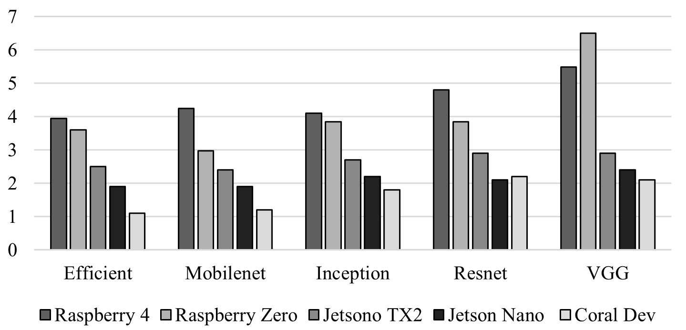
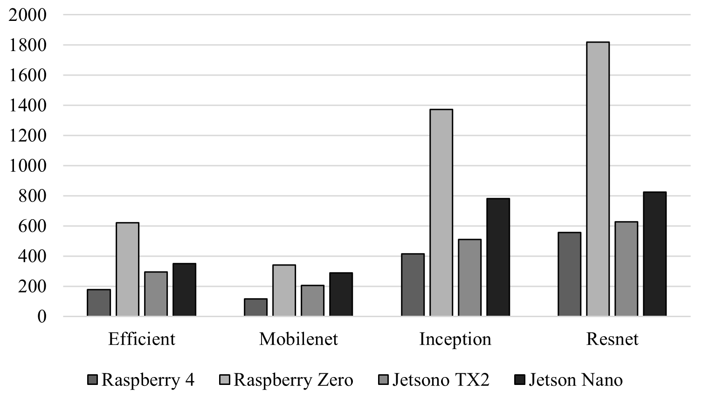

# CNN Architectures Benchmarking in Edge Devices 

Edge devices have become cutting-edge technology to put the ML model closer to the final user. However, their performance in harsh environments plays a fundamental role in designing the electronic device for collecting data, tailoring data to the model's requirements and inferring the decision locally. Therefore, the CNN architecture used to train the ML model is a crucial element since it delivers the power consumption, the execution time, and the system time response. To save time in training ML models, transfer learning is a technique that enables the transfer of knowledge learned from one domain to another, allowing for the development of efficient and accurate models in a new domain. Then, the pre-trained model can be optimized by quantization techniques, which are focused on reducing the number of bits used to represent the weights and activations of a neural network or removing the redundant neurons or layers
from the neural network. In this project, we tested several CNN architectures with some IoT datasets to check their performance with software-centric and hardware-centric metrics when the ML model was or not optimized. 

## Models

The following CNN architectures were tested in this project:

* Resnet 50
* VGG16
* MobileNet V2
* Inception V3
* EfficientNet B0

## Datasets

We selected the following datasets since they represent several harsh environments that Edge devices must face.

* [Leaf illness detection](https://www.kaggle.com/datasets/kaustubhb999/tomatoleaf): This data is used to diagnose plant diseases, and it is taken from experimental research stations associated with Land Grant Universities in the US. The database
contains images of both infected and healthy leaves of 14 crops, such as tomatoes, apples, and others. In this paper, only a set of tomato crop images were used.
* [Waste classification](https://www.kaggle.com/datasets/techsash/waste-classification-data): This targets classification in buildings’ trash bins, which is challenging; smart detectors can either recognize the trash belonging to the bin or have one hole to receive the trash
* [Birds Danish detection](https://www.dof.dk/images/udvalg/su/dokumenter/su_listen/DenDanskeFugleliste_oktober2014.pdf): Denmark has a very active bird spotting community that organizes bird spotting trips every month. One of the more active organizations is Dansk Ornitolo- gisk Forening, DOF (Danish Ornithological Association),
which has more than 17,500 members spread across 13 local branches nationwide. DOF regularly updates the Danish Birds list.
* [Solar panels cracks detection](): Solar modules are composed of many solar cells. The solar cells are subject
to degradation, causing many different types of defects. Defects may occur during the transportation, installation of modules, and operation. The size of cracks may range from tiny to large cracks covering the whole cell.
* [Satellite imagery](): The global dataset for landcover classification is based on annual timeseries data from three different satellites: Sentinel-1, Sentinel-2, and Landsat- 8. The LandCoverNet dataset consists of 300 ortho-
images of size 100x100km2 (referred to as tiles) that are spread across six different regions; (1) Africa, (2) Asia, (3) Australia, (4) Europe, (5) North America an (6) South America. The 300 tiles are distributed among
the regions based on their relative area.

The following table summarizes the datasets' characteristics.

| IoT application | Dataset                | Total Images | Dimension     | Full size | labels |
|-----------------|------------------------|--------------|---------------|-----------|--------|
| Smart farming    | Leaf illness detection | 11000        | 256 × 256 × 3 |  200 MB   |   10   |
| Smart buildings  | Waste classification   | 25000        | 256 × 256 × 3 |  260 MB   |    2   |
| Wildlife detection | Birds detection  | 80000 | 224 × 224 × 3 | 1.5 GB | 18 |
| Industrial operations | Solar panels cracks detection | 2624 | 300 × 300 × 3  | 266 MB | 2 |
| Remote sensing | Satellite imagery | 3500  | 256 × 256 × 3  | 350 MB | 7 |


## Edge devices 

Several Edge devices were taken in consideration in the benchmarking and they are described as follows: 

|Specifications | Raspberry Pi 4 | Raspberry Pi zero | Jetson TX2 | Jetson Nano | Coral Dev Board |
|---------------|----------------|-------------------|------------|-------------|-----------------|
| CPU | Quad core Cortex-A72 64-bit SoC | Quad-core Arm Cortex-A53 | Dual-Core NVIDIA Denver, Quad-Core ARM Cortex-A57 | ARM Cortex-A57 MPCore | Quad Cortex-A53 Cortex-M4F|
| RAM | 4GB SDRAM | 512MB SDRAM | 8GB LPDDR4 | 4GB LPDDR4  | 1 GB LPDDR4 |
| Storage | Micro-SD card (64 GB) | Micro-SD card (64 GB) | 32GB eMMC | Micro-SD card (64 GB) | Micro-SD card (64 GB) |
| Wireless Connectivity | 2.4 GHz and 5.0 GHz IEEE 802.11ac | 2.4GHz 802.11 b/g/n | 2.4GHz 802.11 b/g/n | NN | 802.11a/b/g/n/ac 2.4/5GH |
| Camera Connector | 2-lane MIPI CSI camera port | CSI-2 camera connector | CSI2 D-PHY 1.2 (2.5 Gbps/Lane) | MIPI-DSI x2 | MIPI-CSI2 camera input (4-lane)|
| Hardware accelerator | None | None | NVIDIA Pascal GPU with 256 CUDA cores | 128-core GPU | Google Edge TPU: 4 TOPS (int8)|

## Programming Environment

All models were trained, deployed and tested with 

```bash
TensorFlow 12
```
## Model configuration

Since the model can be fine-tuned in different forms, we set three configurations described as follows: 

* Configuration 1: The first model configuration was set by using the original samples and adding a simple classifier on top of the neural architecture. Then, each model was trained with several IoT datasets and by changing the number of neurons of the last Dense layer, according to the datasets' labels.
* Configuration 2: The second configuration used original samples, and the last n layers of the feature extractor were unfrozen to fine-tune the ML model. The neural architecture search (NAS) revealed that the last 20 layers improved the accuracy score without overfitting the model. Therefore, n is set with a value less than 20 in the second configuration, according to the CNN architecture and dataset.
* Configuration 3: In the last configuration, we used a data augmentation technique to create synthetic samples and feed the ML models
with different features to improve the classifier. This procedure took longer than expected, even when datasets were considered small-medium size. 

## Results

These results are focused on the accuracy metric when the above-mentioned CNN architectures were trained and tested with some IoT datasets.

### Model configuration 1:

In this configuration, some results were promising, especially with Efficient and Inception architectures. 

| Model |	Birds Detection | 	Waste classification | 	Solar Panels crack detection | 	Tomato illness detection |	Satellite imagery |
|-------|-------|-----------|---------|----------|------------|
| Efficient	 | 0.98 |	0.8424	| 0.7 |	0.9062 |	0.8114 |
| Mobilenet |	0.6544	| 0.8408	| 0.7333 |	0.7266 |	0.6833 |
| Inception |	0.9889 |	0.8945 |	0.7167	| 0.75	| 0.7794 |
| Resnet |	0.9667	| 0.8424 |	0.7667 |	0.8672 |	0.7705 |
| VGG	| 0.9444 |	0.8945 |	0.75	 | 0.855 | 	0.7814 |

### Model Configuration 2:

This model configuration got the highest scores since the architectures were unfrozen several layers to fine-tune the pre-trained weights with the new domain. Consequently, this configuration was taken into consideration in the following steps. 

| Model |	Birds Detection | 	Waste classification | 	Solar Panels crack detection | 	Tomato illness detection |	Satellite imagery |
|-------|-------|-----------|---------|----------|------------|
| Efficient	| 1 |	0.9258	| 0.7767	| 0.9609	| 0.8545 |
| Mobilenet |	0.6433 |	0.5316 |	0.65 |	0.4258 |	0.5979 |
| Inception	| 0.9889 |	0.9133 |	0.7667 |	0.8672	| 0.8721 |
| Resnet |	0.9778 |	0.9424 |	0.8 |	0.9206 |	0.8563 |
| VGG |	0.9889	| 0.9133	| 0.8333	| 0.927	| 0.8385 |


### Model Configuration 3:

This configuration got the lowest scores because when we used the data augmentation technique, just some databases were taken in real-trial conditions and the rest of them were made in controlled environments. Therefore, this technique is valuable when the target domain presents challenges related to harsh conditions. If the dataset is made in a controlled environment, this technique should be removed. 

| Model |	Birds Detection | 	Waste classification | 	Solar Panels crack detection | 	Tomato illness detection |	Satellite imagery |
|-------|-------|-----------|---------|----------|------------|
| Efficient |	0.9189 |	0.8606	| 0.6833	 | 0.917 |	0.78149 |
| Mobilenet	|0.3767 |	0.778 |	0.5 |	0.91207 |	0.452 |
| Inception	|0.9356 |	0.8529	| 0.6833 |	0.7695 |	0.79 |
| Resnet	| 0.9289	| 0.85 |	0.6833 |	0.8506 |	0.7765 |
| VGG	| 0.9222	| 0.86129 |	0.7333 |	0.722 |	0.6068 |

### Quantization 

The following results were obtained with model configuration number 2 since it presented better results than others. Tf_lite is made to make inferences without any optimization technique. Pruned is when the model was optimized by skipping the zeroes during inference for latency improvements. We optimized ML Models by using (1) float16 quantization (FQ), which converts weights to 16-bit floating point values, (2) dynamic range quantization (DRQ), which converts weights to 8-bit precision and mixing of floating-point kernels, and (3) Integer quantization (IQ), which is an optimization strategy that converts 32-bit floating- point numbers to the nearest 8-bit fixed-point number. The following table shows the most representative results according to the accuracy metric; FQ was not taken into consideration since their results were similar to using the Tf lite version without any improvement from the model size view.

| Model | Optimization | Size (MB) |	Birds Detection | 	Waste classification | 	Solar Panels crack detection | 	Tomato illness detection |	Satellite imagery |
|-------|-------|------|------|----|---------|----------|------------|
| Efficient | Tf_lite	| 16.12 |	0.98 |	0.8607	| 0.88	| 0.96875 |	0.777 |
|            | Pruned |	16.12	| 0.967 |	0.8987 |	0.9685	0.9375	0.7778
|            | DRQ	| 4.57 |	0.96 |	0.8354 |	0.88 |	0.9375 |	0.8889 |
|            | IQ	| 4.93 |	0.95	| 0.7594 |	0.78 |	0.9375 |	0.7777 |
| Mobilenet | Tf_lite |	8.954 |	0.783 |	0.886 |	0.77 |	0.781 |	0.833 |
|            |  Pruned	| 8.96 |	0.333 |	0.4936 |	0.8 |	0.312 |	0.555 |
|            |  DRQ |	2.52 |	0.666 |	0.848 |	0.5 |	0.4375 |	0.722 |
|            |  IQ |	2.730 |	0.333 |	0.708 |	0.66 |	0.625 |	0.5 |
| Inception | Tf_lite	| 90.812 |	0.95	| 0.886 |	0.886 |	0.78 |	0.85 |
|            | Pruned |	91.77	| 0.92	 | 0.88 |	0.88 |	0.74	| 0.82 |
|            | DRQ |	23.00 | 	0.91	| 0.924 |	0.924 |	0.7	 | 0.65 |
|            | IQ |	23.21	| 0.89 |	0.873 |	0.873 |	0.5 |	0.85 |
| Resnet | Tf_lite	| 101.329 |	0.97	| 0.873 |	0.81 |	0.8125 |	0.722 |
|        | Pruned	| 101.32	| 0.92 |	0.949 |	0.952 |	0.875 |	0.944 |
|        | DRQ |	25.86 |	0.78 | 0.9367 |	0.65	| 0.78 |	0.66 |
|        | IQ | 26.10 |	0.92 | 0.860	| 0.66 |	0.546 |	0.66 |
| VGG | Tf_lite |	58.905 |	0.97	| 0.873 |	0.81 |	0.812 |	0.722 |
|      | Pruned |	58.9 |	0.92 |	0.949 |	0.952 |	0.875 |	0.944 |
|      | DRQ |	14.79 |	0.78	| 0.936 |	0.65 |	0.78 |	0.66 |
|      | IQ	| 14.84 |	0.92	| 0.860 |	0.66 |	0.546 |	0.66 |

### Power consumption
After the models were optimized by the IQ technique, those models were exported into the target Edge devices to run inferences per image and batch of images (y-axis = Watts). 



### Execution time

The next figure shows the execution time when the ML models infer on each Edge device (y-axis = ms).

